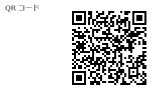

# More Happy Bot

## 製品概要
Happy X Tech

### 背景（製品開発のきっかけ、課題等）

ここに

- 市場調査の授業で何をもって幸せを感じるのかというテーマで調査することになった。
- どうすればより大きな幸せを掴めるのか開発の中でヒントが見つかるかもしれない。

### 製品説明（具体的な製品の説明）

質問にボタンを押して答えていくだけであなたの幸福を点数化し、アドバイスとともに教えてくれます。

### 特長

#### 1. 特長 1

- Line でお手軽診断

#### 2. 特長 2

- 幸福を100点満点で点数化

#### 3. 特長 3

- アドバイスをくれる

### 解決出来ること
今以上の幸せを掴むうえで足りないもののヒントがわかる。

### 今後の展望
今回は実現できなかったが、表情や声など幅広い視点からその人の状態を分析していき、
その結果に基づいてより細やかなサービスや商品のレコメンドをする。

## 開発内容・開発技術
LINE messaging　APIを使ってLINE BOTを作成した。

### 活用した技術
node.js

#### API・データ

今回スポンサーから提供された API、製品などの外部技術があれば記述をして下さい。

- Line messaging API
- aws
-

### 研究内容・事前開発プロダクト（任意）

ご自身やチームの研究内容や、事前に持ち込みをしたプロダクトがある場合は、こちらに実績なども含め記載をして下さい。

-
-

### 独自開発技術（Hack Day で開発したもの）

#### 2 日間に開発した独自の機能・技術

- 独自で開発したものの内容をこちらに記載してください
- 特に力を入れた部分をファイルリンク、または commit_id を記載してください（任意）

